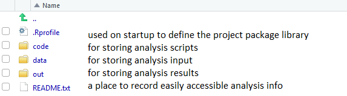
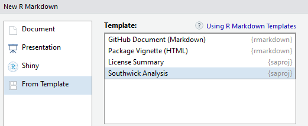

The `saproj` package provides functions & file templates to setup and maintain R-based Southwick analyses. It aims to enable:

- Reproducibility (across time & users)
- Portability (across Windows OS computers)
- Consistency (standard templates for file organization)

The `saproj` approach relies on Southwick-specific R installations, available on Office 365 (R Software > Documents > Installations). These provide a common set of (consistently versioned) R packages that each Southwick analyst can access. The package library can be extended on a project-by-project basis using functions in `saproj` that provide:

**Project Initialization**: 

- `new_project()` to begin a new project with a corresponding package library
- `setup_project()` to set a project libary for an in-progress analysis
- `update_project()` to adapt existing project code for a new project

**Project Portability**: 

- `snapshot_library()` to record packages installed in the project library
- `restore_library()` to restore snapshotted packages to another computer

## R Prerequisites

Familiarity with a few topics is recommended for effective R-based analysis:

- [R Basics](https://www.rstudio.com/online-learning/#R). The [Base R Cheatsheet](https://www.rstudio.com/wp-content/uploads/2016/10/r-cheat-sheet-3.pdf) provides a nice reference.

- Familiarity with the [tidyverse](https://www.tidyverse.org/) generally, and in particular [dplyr](http://dplyr.tidyverse.org/) (for data manipulation) and  [ggplot2](http://r4ds.had.co.nz/data-visualisation.html) (for visualization)

- [RMarkdown](http://rmarkdown.rstudio.com/lesson-1.html) which provides a notebook-based  approach that emphasizes documentation

**Additional Reading**: [R for Data Science](http://r4ds.had.co.nz/) provides in-depth treatment on many R analysis topics.

## Project Initialization

Once a project is initialized with `saproj`, any calls to `install.packages()` will place packages in the appropriate project library. This provides a means to utilize packages not included in the Southwick R installation. Also, because `saproj` specifies an R version and package library for each project, the software dependencies of the analysis can be automatically checked on R startup. This enables the analysis to be easily (and reliably) re-run in the future or on another computer.

### Starting a New Project

The `saproj` package makes it easy to start a project:

1. Create a new project in RStudio by clicking *File > New Project* (see [RStudio Projects](http://r4ds.had.co.nz/workflow-projects.html) for an introduction).

2. Open the *[new-project].Rproj* and run `library(saproj)` followed by `new_project("your-project-name")` from the console. You can run `view_projects()` to check  the availability of project names.

Running `new_project()` populates the project with 3 folders and 2 files. This approach:

- Scales well; accomodating both simple and complex analyses.
- Provides a familiar format, which facilitates collaboration.
- Encapsulates all the necessary parts of an analysis workflow (scripts, data, outputs).

 '

#### Rmd Templates

You can use R Markdown templates from `saproj` when creating a new script:

 '

### Setting an In-progress Project

Run `setup_project("project-name")` to create a project library for an existing project (which `saproj` accomplishes by making an *.Rprofile* file).

### Adapting an existing Project

For repeated projects (or those similar to another project) it can be useful to copy an older project's code and adapt it for a new project. This is facilitated in `saproj` by:

1. Copy the old project analysis folder to a new location (removing old project-specific files that won't be needed such as html documentation and results output).

2. Run `update_project("new-project-name")` to initialize a new project library. Then `restore_library()` can be run to bring any for the original project's packages into the new library.

## Project Portability

Project-specific packages can be installed by simply running `install.packages()` in a project that was setup using `saproj`. After installing packages, you should run `snapshot_library()`, which creates (or updates) a *snapshot-library.csv* that serves as a record of packages installed into the project library. The library can be restored on another machine using `restore_library()`.

## Example Project Structure

Entire analysis in 3 scripts:

- code
    + 1-load.Rmd
    + 2-clean.Rmd
    + 3-do.Rmd

Organizing scripts in sub-folders (i.e., sections):

- code
    + 1-prep/ (1-load.Rmd, 2-clean.Rmd, 3-do.Rmd)
    + 2-profiles/ (etc.)
    + 3-results/ (etc.)

*Note: Making sections can be automated with `new_section()`*
