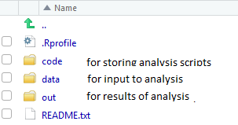

The `saproj` package provides functions & file templates to setup and maintain R-based Southwick analyses. It aims to enable:

- Reproducibility (across time & users)
- Portability (across Windows OS computers)
- Consistency (standard templates for file organization and Rmd code)

Reproducibility and portability are facilitated by the use of Southwick-specific R installations, available on Office 365 (R Software > Documents > Installations). These provide a common set of (consistently versioned) R packages that each Southwick analyst can access. The package library can be extended on a project-by-project basis using functions in `saproj` that provide:

**Project Initialization**: 

- `new_project()` to begin a new project with it's own package library
- `setup_project()` to set a project libary for an in-progress analysis
- `update_project()` to adapt an existing project for a new project

**Project Portability**: 

- `snapshot_library()` to record packages installed in the project library
- `restore_library()` to restore snapshotted packages to another computer

## R Prerequisites

Familiarity with a few topics is recommended for effective R-based analysis:

- [R Basics](https://www.rstudio.com/online-learning/#R). The [Base R Cheatsheet](https://www.rstudio.com/wp-content/uploads/2016/10/r-cheat-sheet-3.pdf) provides a nice reference.

- Familiarity with the [tidyverse](https://www.tidyverse.org/) generally, and in particular [dplyr](http://dplyr.tidyverse.org/) (for data manipulation) and  [ggplot2](http://r4ds.had.co.nz/data-visualisation.html) (for visualization)

- [RMarkdown](http://rmarkdown.rstudio.com/lesson-1.html) which provides a notebook-based  approach that emphasizes documentation

**Additional Reading**: [R for Data Science](http://r4ds.had.co.nz/) provides a useful in-depth treatment on many R analysis topics.

## Project Initialization

### Starting a New Project

The `saproj` package makes it easy to start a project
To begin analysis on a Project:

1. Create a new project in RStudio by clicking *File > New Project* (see [RStudio Projects](http://r4ds.had.co.nz/workflow-projects.html) for an introduction).

2. Run `saproj::new_project("project-name")` from the console. This creates some standard folders and a couple of files that inform project reproducibility:
    + `.Rprofile`: A file that R uses on startup to define the project-specific package library
    + `README.txt`: A place to store project-specific info that another analyst can quickly access

Once a project is initialized, any calls to `install.packages()` will place packages in the appropriate project library. This is useful because it provides a means to use addtional packages not included in the Southwick R installation. Using project-specific libraries in this way also makes the dependencies clear, so projects can be easily re-run on another computer.

#### Folder Structure

Running `new_project()` populates the project with three default folders:

 '

Using this simple directory structure is useful because it:

- Scales well; accomodating both simple and complex analyses.
- Provides a familiar format, which facilitates collaboration.
- Encapsulates all the necessary parts of an analysis workflow (scripts, data, outputs).

### START HERE - Setting an In-progress Project

### Adapting an existing Project

## Project Portability

## OLD STUFF BELOW - maybe drop

## Simple Example Project

Entire analysis in 3 scripts:

- code
    + 1-load.Rmd
    + 2-clean.Rmd
    + 3-do.Rmd
    
You can use R Markdown templates from `saproj` when creating a new R Markdown document:

## More Complex Example Project

Organizing scripts in sub-folders:

- code
    + 1-prep
    + 2-profiles
    + 3-results

Making sections can be automated using `saproj::new_section`
