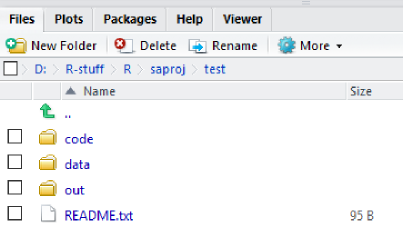
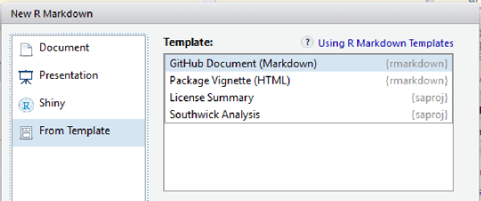

The `saproj` package has two basic purposes:

1. Present guidelines for organizing R-based analyses.

2. Provide a way to automate the creation of project folders & files that follow these guidelines.

## R Prerequisites

Familiarity with a few topics is needed for using `saproj` effectively:

**Required**

- [R Basics](https://www.rstudio.com/online-learning/#R). The [Base R Cheatsheet](https://www.rstudio.com/wp-content/uploads/2016/10/r-cheat-sheet-3.pdf) provides a nice reference.
- Familiarity with the [tidyverse](https://blog.rstudio.org/2016/09/15/tidyverse-1-0-0/) generally and [dplyr](https://cran.rstudio.com/web/packages/dplyr/vignettes/introduction.html) in particular

**Recommended**

- [RMarkdown](http://rmarkdown.rstudio.com/lesson-1.html) for a notebook interface and convenient analysis documentation
- [R for Data Science](http://r4ds.had.co.nz/) for further reading

## Starting a Project

To begin analysis on a Project:

1. Create a new project in RStudio by clicking *File > New Project* (see [RStudio Projects](http://r4ds.had.co.nz/workflow-projects.html) for an introduction).

2. Run `saproj::new_project` from the console. This creates default files & folders, along with a README (which you should update as the analysis progresses).

Using this simple directory structure is useful because it:

- Scales well; accomodating both simple and complex analyses.
- Provides a familiar format, which facilitates collaboration.
- Encapsulates all the necessary parts of an analysis workflow (scripts, data, outputs).

## Simple Example Project

Entire analysis in 3 scripts:

- code
    + 1-load.Rmd
    + 2-clean.Rmd
    + 3-do.Rmd
    
You can use R Markdown templates from `saproj` when creating a new R Markdown document:

## More Complex Example Project

Organizing scripts in sub-folders:

- code
    + 1-prep
    + 2-profiles
    + 3-results

Making sections can be automated using `saproj::new_section`
