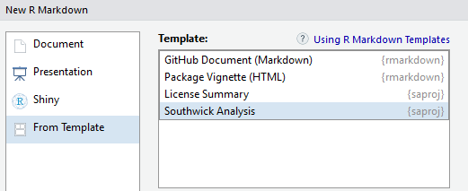

Introduction to saproj
================
Dan Kary
2018-01-16

The `saproj` package provides functions & file templates to setup and
maintain R-based Southwick analyses. It aims to enable:

  - Reproducibility (across time & users)
  - Portability (across Windows OS computers)
  - Consistency (standard templates for file organization)

The `saproj` approach relies on Southwick-specific R installations,
available on Office 365 (R Software \> Documents \> Installations).
These provide a common set of (consistently versioned) R packages that
each Southwick analyst can access. The package library can be extended
on a project-by-project basis using functions in `saproj` that provide:

**Project Initialization**:

  - `new_project()` to begin a new project with a corresponding package
    library
  - `setup_project()` to set a project libary for an in-progress
    analysis
  - `update_project()` to adapt existing project code for a new project

**Project Portability**:

  - `snapshot_library()` to record packages installed in the project
    library
  - `restore_library()` to restore snapshotted packages to another
    computer

## R Prerequisites

Familiarity with a few topics is recommended for effective R-based
analysis:

  - [R Basics](https://www.rstudio.com/online-learning/#R). The [Base R
    Cheatsheet](https://www.rstudio.com/wp-content/uploads/2016/10/r-cheat-sheet-3.pdf)
    provides a nice reference.

  - Familiarity with the [tidyverse](https://www.tidyverse.org/)
    generally, and in particular [dplyr](http://dplyr.tidyverse.org/)
    (for data manipulation) and
    [ggplot2](http://r4ds.had.co.nz/data-visualisation.html) (for
    visualization)

  - [RMarkdown](http://rmarkdown.rstudio.com/lesson-1.html) which
    provides a notebook-based approach that emphasizes documentation

**Additional Reading**: [R for Data Science](http://r4ds.had.co.nz/)
provides in-depth treatment on many R analysis topics.

## Project Initialization

Once a project is initialized with `saproj`, any calls to
`install.packages()` will place packages in the appropriate project
library. This provides a means to utilize packages not included in the
Southwick R installation. Also, because `saproj` specifies an R version
and package library for each project, the software dependencies of the
analysis can be automatically checked on R startup. This enables the
analysis to be easily (and reliably) re-run in the future or on another
computer.

### Starting a New Project

The `saproj` package makes it easy to start a project:

1.  Create a new project in RStudio by clicking *File \> New Project*
    (see [RStudio
    Projects](http://r4ds.had.co.nz/workflow-projects.html) for an
    introduction).

2.  Open the *new-project.Rproj* and run `library(saproj)` followed
    by `new_project("your-project-name")` from the console. You can run
    `view_projects()` to check the availability of project names.

Running `new_project()` populates the project with 3 folders and 2
files. This approach:

  - Scales well; accomodating both simple and complex analyses.
  - Provides a familiar format, which facilitates collaboration.
  - Encapsulates all the necessary parts of an analysis workflow
    (scripts, data, outputs).

 ’

#### Rmd Templates

You can use R Markdown templates from `saproj` when creating a new
script:

 ’

### Setting an In-progress Project

Run `setup_project("project-name")` to create a project library for an
existing project (which `saproj` accomplishes by making an *.Rprofile*
file).

### Adapting an existing Project

For repeated projects (or those similar to another project) it can be
useful to copy an older project’s code and adapt it for a new project.
This is facilitated in `saproj` by:

1.  Copy the old project analysis folder to a new location (removing old
    project-specific files that won’t be needed such as html
    documentation and results output).

2.  Run `update_project("new-project-name")` to initialize a new project
    library. Then `restore_library()` can be run to bring any for the
    original project’s packages into the new library.

## Project Portability

Project-specific packages can be installed by simply running
`install.packages()` in a project that was setup using `saproj`. After
installing packages, you should run `snapshot_library()`, which creates
(or updates) a *snapshot-library.csv* that serves as a record of
packages installed into the project library. The library can be restored
on another machine using `restore_library()`.

## Example Project Structure

Entire analysis in 3 scripts:

  - code
      - 1-load.Rmd
      - 2-clean.Rmd
      - 3-do.Rmd

Organizing scripts in sub-folders (i.e., sections):

  - code
      - 1-prep/ (1-load.Rmd, 2-clean.Rmd, 3-do.Rmd)
      - 2-profiles/ (etc.)
      - 3-results/ (etc.)

*Note: Making sections can be automated with `new_section()`*
